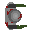

 

# Zombie Shooter | Project Touchstone #
[How to make a Top Down Shooter in Godot 4](https://www.youtube.com/watch?v=sprqJn6g_e0) by [Kaan Alpar](https://www.youtube.com/@KaanAlpar) ([GitHub](https://github.com/KaanAlpar))

# Assets #
[Zombie Shooter Assets](https://github.com/KaanAlpar/godot-topdown-shooter/tree/main/assets/textures) by [Kaan Alpar](https://www.youtube.com/@KaanAlpar) ([GitHub](https://github.com/KaanAlpar))

# Create a Godot task #
<ins> What application is this task for? </ins>
 
Godot

### **Task prompt** ###
First, enter the **task prompt** and any relevant reference files (e.g., docs, diagrams, sketches, photos, schematics).

Tasks should sound like what a manager might give a skilled but junior employee: high-level guidance with some leeway on executional details, but with very clear success metrics. What a good outcome looks like must be very clear and easy to understand.

Please include any relevant **reference files** (e.g., docs, diagrams, sketches, photos, schematics) needed to complete this task.

Reminder on the difference between reference and starting state files:
- **Reference files**: anything the Employee should look at or read while completing the project that does not need to be directly loaded into the application (*'please make something that looks like XYZ image'*)
- **Starting state files (upload below)**: anything that the Employee would need to load into their workspace to complete the task (*'here is the existing file you should adapt'*)

<ins> Task prompt (ask the Employee) </ins>
 

<ins> Which of the following best fits this task? </ins>
 
Task from scratch

<ins> How long would you anticipate an 'Employee' to complete this task? (in hours) </ins>
 
5

### **Starting state** ###
Please describe and include below any information about the starting state of this project:
- Existing work to be modified
- Other assets or other inputs the Employee needs to bring to be able to complete this task

Reminder on the difference between the starting state and the reference files:
- **Starting state files**: anything that the Employee would need to load into their workspace to complete the task ('*here is the existing file you should adapt*')
- **Reference files (upload above)**: anything the Employee should look at or read while completing the project that does not need to be directly loaded into the application ('*please make something that looks like XYZ image*')

<ins> Starting state description </ins>
 

### **Overall context** ###
Finally, include context on this task and why it is realistic and representative of real-life work:
- Why is this a reasonable task for a manager to ask a junior-level employee to do?
- Is there a larger project it might be a part of?

<ins> Task context </ins>
 

<ins> Rubric Items </ins>
 

 
Godot - Full Vertical Slice (Game Prototype) - Finished prompt creation.
